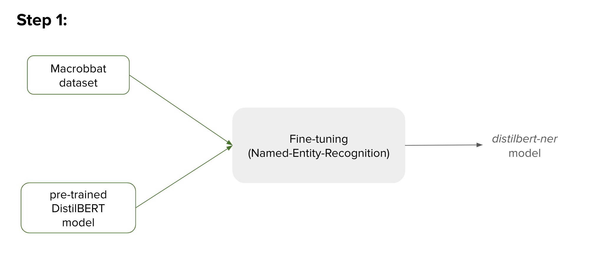
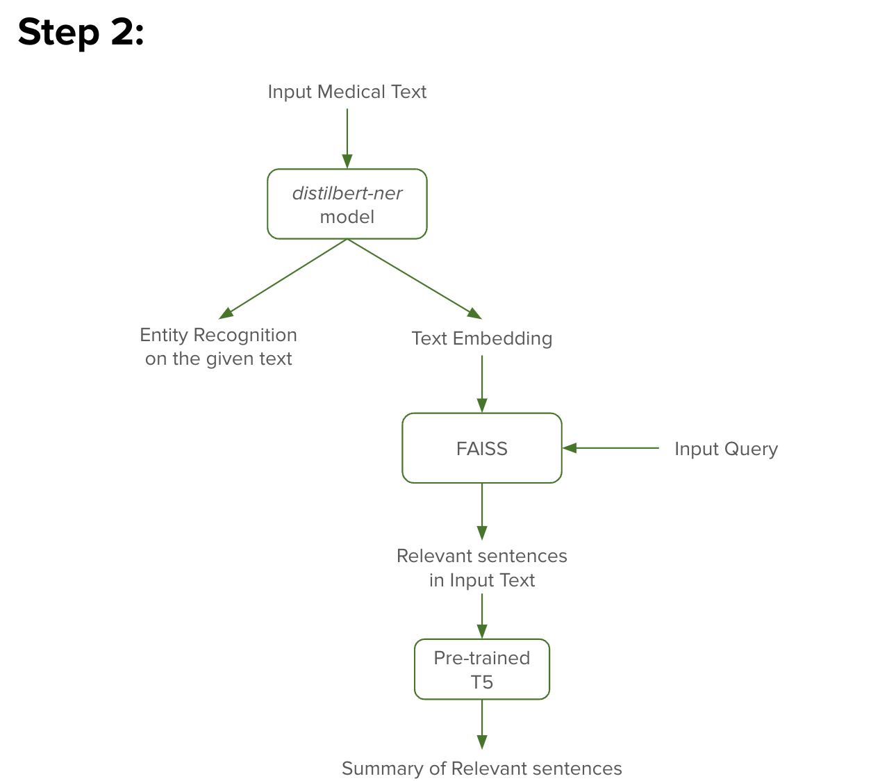

# Frontera-Health

## Workflow

The workflow of the project is as follows:

#### Step 1


* Pre-trained [DistilBERT](https://huggingface.co/docs/transformers/model_doc/distilbert) model is fine-tuned on [Maccrobat data](https://figshare.com/articles/dataset/MACCROBAT2018/9764942), a medical entity dataset, for Named-Entity-Recognition (NER) task.
* I have hosted the fine-tuned *distilbert-ner* model on HuggingFace model hub. The model can be accessed from [here](https://huggingface.co/SahuH/distilbert-ner)
* The complete training code can be accessed in `NER_training.ipynb` notebook

### Step 2


 * Here, given a medical report, the fine-tuned *distilbert-ner* model is used to predict the medical entities in the report
* *distilbert-ner* model also outputs contextual embeddings for the input medical report, which would be used for relevant information retrieval
* Given a query by the user, I have used FAISS to retrieve most relevant sentences in the medical report
* As a final step, summary of the retrieved sentences is generated using pre-trained T5 (*t5-base*) model
* Step 2 integrates all the tasks of the project. Run `run.ipynb` to execute Step 2


`example_run.pdf` contains a sample run of the project for an example 


## Dependencies
```         
pip install -r requirements.txt
```